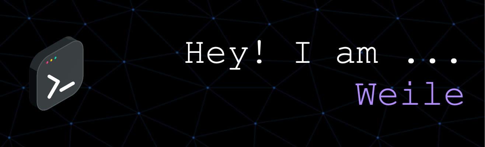

# Welcome! 🙌

#### 〽️ Undergraduate Computer Science Student at University of Michigan  
California 📍

Aspired Software Engineer 💻

Machine Learning Enthusiast 🚀

Piano Player 🎹

Hooper 🏀

<!--

# Languages & Tools

https://agreeable-pond-087f7a90f.1.azurestaticapps.net

**Weile-Zheng/Weile-ZHeng** is a ✨ _special_ ✨ repository because its `README.md` (this file) appears on your GitHub profile.

  

Here are some ideas to get you started:

👋 
- 🔭 I’m currently working on ...
- 🌱 I’m currently learning ...
- 👯 I’m looking to collaborate on ...
- 🤔 I’m looking for help with ...
- 💬 Ask me about ...
- 📫 How to reach me: ...
- 😄 Pronouns: ...
- ⚡ Fun fact: ...
-->
